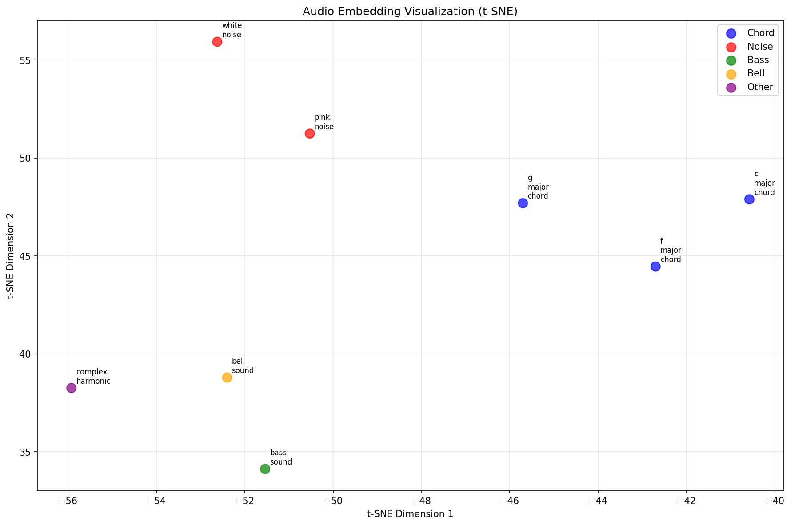

# Audio Embeddings with OpenL3

Generate and analyze deep audio embeddings using OpenL3 for music similarity detection and clustering.

## Embedding Visualization



*t-SNE visualization showing how different audio types cluster in the embedding space*

## Test Audio Dataset

The system is validated using synthetic audio with distinct characteristics:

- **c_major_chord.mp3** - C major chord (C-E-G notes)
- **g_major_chord.mp3** - G major chord (G-B-D notes) 
- **f_major_chord.mp3** - F major chord (F-A-C notes)
- **bass_sound.mp3** - Low frequency sine wave (80 Hz)
- **bell_sound.mp3** - High frequency sine wave (1000 Hz)
- **complex_harmonic.mp3** - Multi-frequency harmonic series (220, 440, 880, 1320 Hz)
- **white_noise.mp3** - Random white noise
- **pink_noise.mp3** - Pink noise (1/f spectrum)

## Overview

This project demonstrates how to use OpenL3 deep learning models to convert audio into 512-dimensional embeddings that capture musical characteristics. The system processes audio files and generates vector representations that can be used for similarity analysis and clustering.

## Key Features

- **Deep audio embeddings** using OpenL3 model (mel256, music content)
- **Similarity analysis** with cosine and Euclidean distance metrics
- **SQLite storage** for efficient embedding retrieval
- **Visualization tools** for embedding space exploration
- **Synthetic audio generation** for testing and validation

## Installation

```bash
uv sync
```

## Usage

### 1. Generate Test Audio
Create synthetic audio files with different characteristics:
```bash
uv run python create_test_audio.py
```

### 2. Generate Embeddings
Process audio files and store embeddings in database:
```bash
uv run python simple_embed.py
```

### 3. Analyze Similarities
Compare embeddings and visualize results:
```bash
uv run python compare_embeddings.py
```

## Results

The system successfully demonstrates meaningful audio similarity detection. Similar audio types (e.g., major chords) cluster together with higher similarity scores than dissimilar types (e.g., chords vs. noise).

## Performance

- **Processing Speed**: ~0.5 seconds per second of audio input (CPU)
- **Embedding Dimensions**: 512
- **Storage**: ~4KB per 30-second audio track
- **Database**: SQLite with BLOB storage for vectors

## Architecture

- **Input**: Audio files (MP3, WAV, etc.)
- **Model**: OpenL3 pretrained on music content
- **Processing**: Max pooling across time dimension
- **Output**: 512-dimensional float64 vectors
- **Storage**: SQLite database (`metadata/songs.db`)

## Files

- `simple_embed.py` - Main embedding generation script
- `compare_embeddings.py` - Similarity analysis and visualization
- `create_test_audio.py` - Synthetic audio generator for testing
- `embed.py` - Original batch processing implementation
- `files.py` - Path configuration

## Testing

The project includes comprehensive testing with synthetic audio:
- **Chord progressions** (C, G, F major) - should be highly similar
- **Noise types** (white, pink) - should be similar to each other
- **Tonal sounds** (bass, bell, harmonic) - should be distinct

Results demonstrate that the embeddings capture meaningful musical relationships and can effectively distinguish between different audio characteristics.